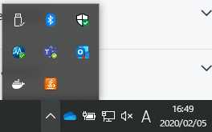
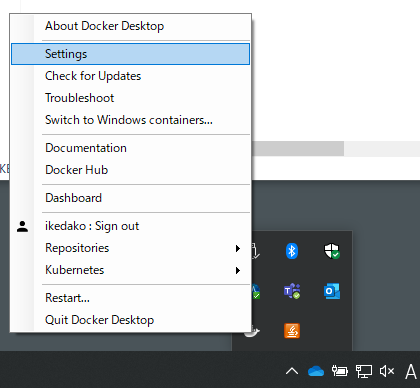
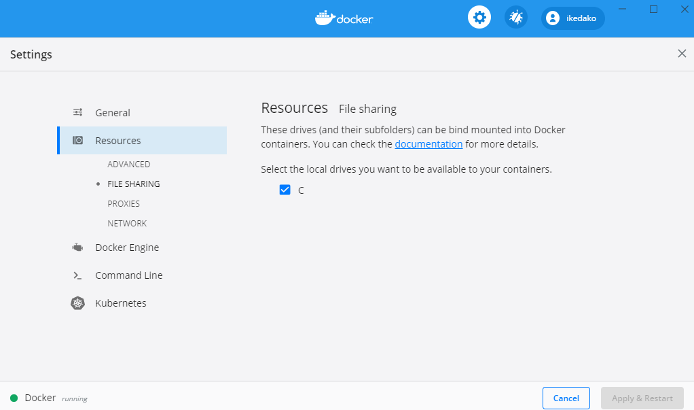

# Docker勉強会

## 概要

1. Dockerについて
2. Dockerfileについて
3. Docker Composeについて

---

## 準備

Windows10 Pro環境を前提に話を進めます。

### git clone

このリポジトリを任意の場所に`git clone`してください。

```shell
$ git clone https://github.com/ikedakohei/v_docker_tutorial.git
```

### Docker Desktop for Windowsのインストール

[こちら](https://sukkiri.jp/technologies/virtualizers/docker/docker-win_install.html)を参考にインストールするとわかりやすいかもしれません。

### vscodeにdocker拡張機能を入れる

[こちら](https://marketplace.visualstudio.com/items?itemName=ms-azuretools.vscode-docker)の拡張機能を入れておいてください。

### FILE SHARINGの設定

ホスト側とコンテナ側でファイルをシェア（bindマウント）できるように`FILE SHARING`の設定をしてください。

クジラのマークを右クリックしてください。



`Settings`を選択してください。



`FILE SHARING`を選択してgit cloneしたディレクトリのあるドライブを指定して、チェックを入れてください。



`Apply & Restart` ボタンを押してください。

---

## 1. Dockerについて

### Dockerとは

[wikipedia](https://ja.wikipedia.org/wiki/Docker)より引用

> Dockerは、コンテナと呼ばれるOSレベルの仮想化環境を提供するオープンソースソフトウェアである。VMware製品などの完全仮想化を行うハイパーバイザ型製品と比べて、ディスク使用量は少なく、仮想環境 (インスタンス) 作成や起動は速く、性能劣化がほとんどないという利点を持つ。

Webアプリなどの開発環境や本番環境構築を楽にしてくれるものと捉えておけばよい気がします。

### Dockerコンテナとは

アプリケーションの実行環境です。イメージをもとにコンテナを起動します。

### Dockerコンテナの実行

`docker run`コマンドを使用します。

```shell
$ docker run イメージ名
```

### Dockerイメージとは

- コンテナ実行に必要なファイルをまとめたファイルシステム
- イメージ上のデータはレイヤで構成された読み取り専用

[Docker Hub](https://hub.docker.com/)などのレジストリに置いてあります。イメージを自分のローカルマシンにpullすることによって、イメージを共有することができます。

読み取り専用で編集不可のため、同じ環境を共有できます。

### Docker Hubとは

[Dockerイメージの置いてある場所](https://hub.docker.com/)です。公式のものと公式でないものがあります。

- Rubyの[公式イメージ](https://hub.docker.com/_/ruby)
- CircleCIの用意した[Rubyのイメージ](https://hub.docker.com/r/circleci/ruby)（公式ではない）

それぞれのイメージにはタグがあります。`ruby:2.6.5`というイメージであれば、`2.6.5`というのがタグです。

タグを指定しない場合は`latast`タグが指定されます。つまり、`ruby`というイメージと、`ruby:latest`というイメージは同じものになります。

## 演習1：docker runコマンド

dockerでhello worldします。実際に自分のローカルPCで試してみてください。

```shell
$ docker run hello-world
Unable to find image 'hello-world:latest' locally
latest: Pulling from library/hello-world
1b930d010525: Pull complete
Digest: sha256:9572f7cdcee8591948c2963463447a53466950b3fc15a247fcad1917ca215a2f
Status: Downloaded newer image for hello-world:latest

Hello from Docker!
This message shows that your installation appears to be working correctly.

To generate this message, Docker took the following steps:
 1. The Docker client contacted the Docker daemon.
 2. The Docker daemon pulled the "hello-world" image from the Docker Hub.
    (amd64)
 3. The Docker daemon created a new container from that image which runs the
    executable that produces the output you are currently reading.
 4. The Docker daemon streamed that output to the Docker client, which sent it
    to your terminal.

To try something more ambitious, you can run an Ubuntu container with:
 $ docker run -it ubuntu bash

Share images, automate workflows, and more with a free Docker ID:
 https://hub.docker.com/

For more examples and ideas, visit:
 https://docs.docker.com/get-started/
```

厳密には違うみたいですが、`docker run`コマンドは3つのコマンドに分割できます。

1. `docker pull` : イメージの取得
2. `docker create` : コンテナの作成
3. `docker start` : コンテナの起動

もう一回`docker run hello-world`を実行すると、イメージがすでにローカルにあるので、`hello-world`イメージのプルはしません（イメージは増えない）。しかし、コンテナは増えます。

---

## 2. Dockerfileについて

> Dockerで定義されている書式に従って記述し、それに基づいてアプリケーションのインストールなどを行い、Dockerイメージの作成を行います。

[Docker実践ガイド 第2版](https://www.amazon.co.jp/dp/B07NDT526Q) P132より引用

Dockerfileの基本的な書き方

```dockerfile
# 元となるイメージの取得
FROM docker/whalesay:latest
# イメージビルド時に実行する命令
RUN apt-get -y update && apt-get install -y fortunes
# コンテナ起動時に実行する命令
CMD /usr/games/fortune | cowsay
```

### docker buildコマンド

`docker build`コマンドは、Dockerfileからイメージをビルドするコマンドです。

```shell
# タグ名は省略可。省略した場合はlatestタグがつく
$ docker build -t イメージ名:タグ名 Dockerfileのあるディレクトリ
```

```shell
# Dockerfileのあるディレクトリで実行
# タグ名をver1と指定している。指定しない場合はlatestタグが作成される
$ docker build -t docker-whale:ver1 .
```

`docker run`コマンドでコンテナの実行をしてみます。コンテナ起動時に実行される命令である`/usr/games/fortune | cowsay`が実行されるはずです。

```shell
# --nameオプションでコンテナ名を指定できる
$ docker run --name whale docker-whale:ver1
```

## 演習2：Dockerfileを作成して、docker build + docker run

自分のローカルPCで上記のDockerfileを作成し、`docker build`および`docker run (--nameオプションをつける)`を実行してみてください。

`docker build`するときのイメージにつけるタグ名は任意のもので構いません。

`docker run`するときの`--name`オプションにつける名前は任意のもので構いません。

---

## 3. Docker Composeについて

> 複数のDockerコンテナの設定を別々に手動で行うのではなく、1つのYMLファイルに複数のコンテナを定義し、Dockerコンテナを一括で構築、連携、管理することで、管理者の管理負荷を低減するツールが提供されています。それがDocker Composeです。

[Docker実践ガイド 第2版](https://www.amazon.co.jp/dp/B07NDT526Q) P276より引用

### Compose実行のステップ

1. `Dockerfile`を用意するか、`Docker Hub`などに置いてあるイメージを使用する
2. `docker-compose.yml`を定義する
3. `docker-compose up`を実行する

> Compose ファイルは [YAML](http://yaml.org/) ファイルであり、 [サービス（services）](http://docs.docker.jp/compose/compose-file.html#service-configuration-reference) 、 [ネットワーク（networks）](http://docs.docker.jp/compose/compose-file.html#network-configuration-reference) 、 [ボリューム（volumes）](http://docs.docker.jp/compose/compose-file.html#volume-configuration-reference) を定義します。Compose ファイルのデフォルトのパスは`./docker-compose.yml`です。

[こちら](http://docs.docker.jp/compose/compose-file.html)より引用

Docker Composeについては[公式サイト](https://docs.docker.com/compose/compose-file/)（英語）を読むのがよさそうです。

### Docker ComposeでRails + PostgreSQLの環境構築

このリポジトリの[rails app](https://github.com/ikedakohei/v_docker_tutorial/tree/master/rails_app)内に[Dockerfile](https://github.com/ikedakohei/v_docker_tutorial/blob/master/rails_app/Dockerfile)と[docker-compose.yml](https://github.com/ikedakohei/v_docker_tutorial/blob/master/rails_app/docker-compose.yml)があると思います。まずは、それぞれのファイルについて解説します。

#### Dockerfile

```Dockerfile
# イメージの指定
FROM ruby:2.6.5

# rails環境を構築するのに必要なパッケージのインストール
RUN apt-get update -qq && apt-get install -y build-essential libpq-dev nodejs

# 作成するイメージ内に/var/www/rails_appというディレクトリを作成
RUN mkdir -p /var/www/rails_app
# 作業ディレクトリ（working directory）を/var/www/rails_appに指定
WORKDIR /var/www/rails_app

# ホスト側にあるGemfileを/var/www/rails_app内にコピー
COPY Gemfile Gemfile
# ホスト側にあるGemfile.lockを/var/www/rails_app内にコピー
COPY Gemfile.lock Gemfile.lock

# bundlerというgem(ruby用のライブラリ)をインストール
RUN gem install bundler
# Gemfile(Gemfile.lock)に記述されているgemを一括でインストール
RUN bundle install
```

- `FROM`は以降の命令で使う ベース・イメージ を指定する命令
- `RUN`はイメージビルド時に実行する命令
- `WORKDIR`はDockerfileで`RUN` `CMD` `COPY` `ADD` などの命令実行時の作業ディレクトリ（working directory）を指定する命令
- `COPY`はホスト側にあるファイルやディレクトリをコンテナ内のファイルシステム上にコピーする命令

#### docker-compose.yml

```yaml
# Composeファイルのバージョンを指定
version: '3.7'
# postgres_dataというVolumeをホスト側に作成
volumes:
  postgres_data: {}
# webとして定義されたコンテナとdbとして定義されたコンテナを作成
services:
  web:
    build: . # カレントディレクトリにあるDockerfileをもとにイメージをビルド
    command: bundle exec rails s -b '0.0.0.0' # コンテナ起動時に実行されるコマンド
    volumes:
      - type: bind # bindマウント
        source: . # ホスト側のパスを指定
        target: /var/www/rails_app # コンテナ側のパスを指定
    ports:
      - "3000:3000" # ホスト:コンテナのポート番号で、ポートを公開
    depends_on:
      - db # dbのコンテナが起動してから、webのコンテナが起動する
  db:
    image: postgres:12.1 # Docker Hubにあるpostgres:12.1イメージをpull
    volumes:
      - type: volume # volumeマウント
        source: postgres_data # 5行目で作成したVolumeを指定
        target: /var/lib/postgresql/data # コンテナ側のパスを指定
```

### Volumeとは

ボリュームとは、データを永続化できる場所のことです。ストレージ的な場所をホスト側に作成します。

### volumeマウントとは

作成したVolumeとコンテナ内の特定の場所をマウント（ファイルやディレクトリを共有）します。

[DockerHub公式リポジトリのpostgres](https://registry.hub.docker.com/_/postgres/)のPostgreSQLデータ領域は`/var/lib/postgresql/data`なので、このデータ領域をホスト側から共有できればPostgreSQLのコンテナを消してもデータは残ります。

### bindマウントとは

ホスト側とコンテナ側で特定のディレクトリをマウント（ファイルやディレクトリを共有）できるようになります。コンテナ側でファイルを変更すればホスト側でもそのファイルの変更が反映されます。ホスト側の変更もコンテナ側に反映されます。

### docker-compose コマンド

詳しくは[こちら](https://qiita.com/wasanx25/items/d47caf37b79e855af95f)を参照。

- `docker-compose up`はコンテナを作成して、起動する。オプションで`-d`をつけることでバックグラウンドで実行することができる。
- `docker-compose build`はサービス（今回の例だと、`web`と`db`）をビルドする。
- `docker-compose run`はコンテナを作成して、コンテナ内のコマンドを実行する。`docker run サービス名 コマンド`のように使う。
- `docker-compose exec`は稼働中のコンテナ内でコマンドを実行する（コンテナを作成しない）。`docker exec サービス名 コマンド`のように使う。
- `docker-compose start`はサービスを開始する。
- `docker-compose stop`はサービスを停止する。
- `docker-compose down`はサービスを参考にコンテナを停止し、そのコンテナとネットワークを削除する。

## 演習3：Docker Composeで環境構築を実際にしてみる

自分のローカルPCのターミナル上でrails_appディレクトリへ移動して、下記を実行してください。

```shell
# docker-compose.ymlがあるディレクトリで実行
$ docker-compose up -d
```

無事にコンテナが作成されたら、任意のブラウザで`http://localhost:3000/`にアクセスしてみてください。

DBがありませんというようなエラー画面がでると思うので、DBを作成します。

```shell
# docker-compose.ymlがあるディレクトリで実行
$ docker-compose exec web bundle exec rails db:create
```

再び、`http://localhost:3000/`にアクセスします。`Yay! You’re on Rails!`というページがでてくれば、Rails + PostgreSQLの環境構築に成功しました。

---

## 参考

- [Docker公式サイト](https://www.docker.com/)
- [Dokcer Hub](https://hub.docker.com/)
- [参考にしたQiitaの記事1](https://qiita.com/kotaro-dr/items/b1024c7d200a75b992fc)
- [参考にしたQiitaの記事2](https://qiita.com/shiro01/items/04ca672a93384b463701)
- [Docker実践ガイド 第2版](https://www.amazon.co.jp/dp/B07NDT526Q)
- [ゼロからはじめる Dockerによるアプリケーション実行環境構築（Udemy）](https://www.udemy.com/course/docker-k/)
